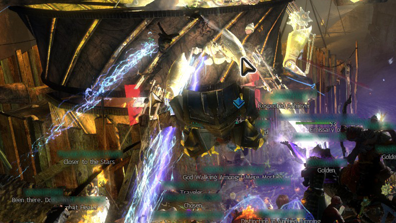

These cursors are pretty simple. They are basically the original cursors with
a black and white border around it.

 
Can you see the difference on how easy or difficult it is to spot both cursors
in this somewhat-but-not-so-extreme chaotic GFX mess?
