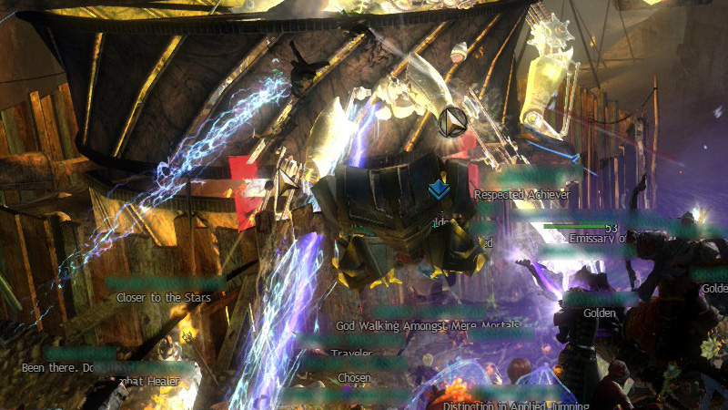
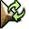
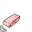

# Circle cursors
These cursors have a semi-transparent black, Guild Wars 2 style circle behind them.
While they do not stand out as much as the fat or sharp cursors do, you should still be able to spot these cursors fairly quickly.
And because the is no extra border around these cursors, the so-called "hot spot" should still be the same as the original cursors, making it easier to adjust to these customized cursors if you are used to precision clicking.

## Preview

## Cursor assignment
Don't forget to check [assignments.txt](assignments.txt) for the YoloMouse compatible version if you don't want to assign the cursors manually.
Instructions can be found in the main readme under 'Troubleshooting'.

File | Original                              | Default key-bind
-----|---------------------------------------|-------------
30   |  | `Ctrl + Alt + Shift + 4`
31   |  | `Ctrl + Alt + Shift + 4` ×2
32   |  | `Ctrl + Alt + Shift + 4` ×3
33   |  | `Ctrl + Alt + Shift + 4` ×4
34   |  | `Ctrl + Alt + Shift + 4` ×5
35   |  | `Ctrl + Alt + Shift + 4` ×6
36   |  | `Ctrl + Alt + Shift + 4` ×7
37   |  | `Ctrl + Alt + Shift + 4` ×8
38   |  | `Ctrl + Alt + Shift + 4` ×9
39   |  | `Ctrl + Alt + Shift + 4` ×10
40   |  | `Ctrl + Alt + Shift + 5`
41   |  | `Ctrl + Alt + Shift + 5` ×2
42   |  | `Ctrl + Alt + Shift + 5` ×3
43   |  | `Ctrl + Alt + Shift + 5` ×4
44   |  | `Ctrl + Alt + Shift + 5` ×5
45   |  | `Ctrl + Alt + Shift + 5` ×6
46   |  | `Ctrl + Alt + Shift + 5` ×7
47   |  | `Ctrl + Alt + Shift + 5` ×8
48   |  | `Ctrl + Alt + Shift + 5` ×9
49   |  | `Ctrl + Alt + Shift + 5` ×10
50   |  | `Ctrl + Alt + Shift + 6`
51   |  | `Ctrl + Alt + Shift + 6` ×2
52   |  | `Ctrl + Alt + Shift + 6` ×3
53   |  | `Ctrl + Alt + Shift + 6` ×4
     |  | N/A
     |  | N/A
     |  | N/A
