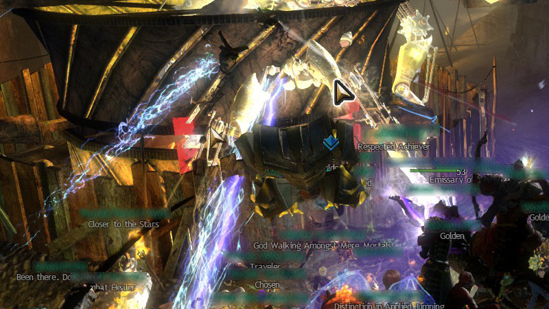
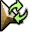
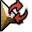
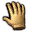
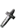
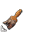
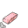

# Fat cursors

These fat cursors are basically the original cursors with a black and white
border around it. The downsides to these cursors are that because of the border,
it might be hard to get used to the so-called "hot spot" and the rounded borders
themselves.

But if you want the keep the original cursors, while having a fat border around
it, these cursors are the way to go.

 
Can you see the difference between how easy and difficult it is to spot both
cursors in this somewhat-but-not-so-extreme chaotic FX mess?

## Cursor assignment
File | Original                              | Default key-bind
-----|---------------------------------------|-------------
30   |  | `CTRL + ALT + Shift + 4`
31   |  | `CTRL + ALT + Shift + 4` ×2
32   |  | `CTRL + ALT + Shift + 4` ×3
33   |  | `CTRL + ALT + Shift + 4` ×4
34   |  | `CTRL + ALT + Shift + 4` ×5
35   |  | `CTRL + ALT + Shift + 4` ×6
36   |  | `CTRL + ALT + Shift + 4` ×7
37   |  | `CTRL + ALT + Shift + 4` ×8
38   |  | `CTRL + ALT + Shift + 4` ×9
39   |  | `CTRL + ALT + Shift + 4` ×10
40   |  | `CTRL + ALT + Shift + 5`
41   |  | `CTRL + ALT + Shift + 5` ×2
42   |  | `CTRL + ALT + Shift + 5` ×3
43   |  | `CTRL + ALT + Shift + 5` ×4
44   |  | `CTRL + ALT + Shift + 5` ×5
45   |  | `CTRL + ALT + Shift + 5` ×6
46   |  | `CTRL + ALT + Shift + 5` ×7
47   |  | `CTRL + ALT + Shift + 5` ×8
48   |  | `CTRL + ALT + Shift + 5` ×9
49   |  | `CTRL + ALT + Shift + 5` ×10
50   |  | `CTRL + ALT + Shift + 6`
51   |  | `CTRL + ALT + Shift + 6` ×2
52   |  | `CTRL + ALT + Shift + 6` ×3
53   |  | `CTRL + ALT + Shift + 6` ×4
-    |  | N/A
-    |  | N/A
-    |  | N/A

Note that when using these cursors, YoloMouse might use the wrong default size
which might cause the cursors to look too small or too big compared to the
original cursors. When this happens, press `CTRL + ALT + Shift + -` multiple
times until the cursors have their correct size.
