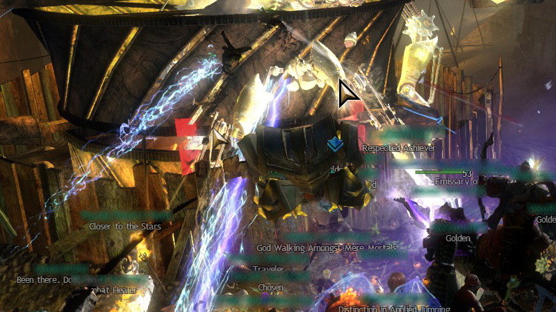

# Sharp cursors
These sharp cursors are basically the original cursors with a black and smaller white border around it.
Compared to the fat cursors, these cursors have a 1 pixel white border, instead of 3 pixels, which makes them less fat.
The borders are also sharp, instead of rounded, which makes it easier to get used to the so-called "hot spot".

If you want the keep the original cursors, while having a not-too-fat border around it, these cursors are the way to go.

## Preview

## Cursor assignment
Don't forget to check [assignments.txt](assignments.txt) for the YoloMouse compatible version if you don't want to assign the cursors manually.
Instructions can be found in the main readme under 'Troubleshooting'.

File | Original                              | Default key-bind
-----|---------------------------------------|-------------
30   |  | `Ctrl + Alt + Shift + 4`
31   |  | `Ctrl + Alt + Shift + 4` ×2
32   |  | `Ctrl + Alt + Shift + 4` ×3
33   |  | `Ctrl + Alt + Shift + 4` ×4
34   |  | `Ctrl + Alt + Shift + 4` ×5
35   |  | `Ctrl + Alt + Shift + 4` ×6
36   |  | `Ctrl + Alt + Shift + 4` ×7
37   |  | `Ctrl + Alt + Shift + 4` ×8
38   |  | `Ctrl + Alt + Shift + 4` ×9
39   |  | `Ctrl + Alt + Shift + 4` ×10
40   |  | `Ctrl + Alt + Shift + 5`
41   |  | `Ctrl + Alt + Shift + 5` ×2
42   |  | `Ctrl + Alt + Shift + 5` ×3
43   |  | `Ctrl + Alt + Shift + 5` ×4
44   |  | `Ctrl + Alt + Shift + 5` ×5
45   |  | `Ctrl + Alt + Shift + 5` ×6
46   |  | `Ctrl + Alt + Shift + 5` ×7
47   |  | `Ctrl + Alt + Shift + 5` ×8
48   |  | `Ctrl + Alt + Shift + 5` ×9
49   |  | `Ctrl + Alt + Shift + 5` ×10
50   |  | `Ctrl + Alt + Shift + 6`
51   |  | `Ctrl + Alt + Shift + 6` ×2
52   |  | `Ctrl + Alt + Shift + 6` ×3
53   |  | `Ctrl + Alt + Shift + 6` ×4
-    |  | N/A
-    |  | N/A
-    |  | N/A
