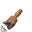

These are the original cursors used by Guild Wars 2.
The filenames correspond with the internal filename in the gw2.dat file.
However, the icon packs may use a different order or might not even use certain icons at all.

File   | Image                 | Description
-------|-----------------------|-------------
255329 |  | Default cursor
255330 |  | Enemy target
255331 |  | Target out of range
255332 |  | Dismiss hint popup
255333 |  | Pick dye color
255334 |  | Apply dye color
255335 |  | Clear dye color
255337 |  | Friendly target
255338 |  | AoE skill target
255339 |  | AoE skill target out of range
255340 |  | Interactable target
255341 |  | Interactable target out of range
255342 |  | Alternative interactable target (e.g. warrior banners)
255343 |  | Alternative interactable target out of range (e.g. warrior banners)
255344 |  | Resurrect ally
255345 |  | Resurrect ally out of range
255346 |  | Click for more details (e.g. top-right story info)
255347 |  | Interactable NPC
255348 |  | Interactable NPC out of range
255351 |  | Dragging cursor
255352 |  | Salvaging
255353 |  | Salvaging impossible
255356 |  | Extend window horizontally
255357 |  | Extend window vertically
255358 |  | Extend window diagonally (bottom-left to top-right)
255359 |  | Extend window diagonally (top-left to bottom-right)
547823 |  | Click for more details (e.g. top-right live info)
